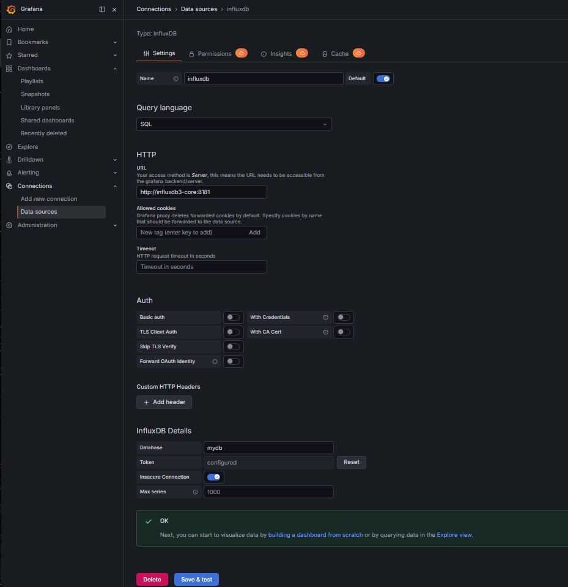

# Concentrador IoT — Angamed Hydroponic Automation System

Stack de concentrador local para el sistema de automatización hidropónica Angamed. Recibe telemetría de los nodos periféricos ESP32 vía MQTT, la persiste en InfluxDB 3 Core y la visualiza en tiempo real con Grafana.

Este stack corresponde a la Capa 2 (Gateway Local) de la arquitectura de tres capas descrita en el documento técnico de base del proyecto.

## Estado actual

Fase 1 completa y en operación. Los cinco servicios corren en Docker Compose y reciben datos reales del nodo de tanque (`feature/nodo-tanque`) además del simulador incluido para desarrollo sin hardware.

## Demo


## Arquitectura


Todos los servicios corren como contenedores Docker en un único host — Raspberry Pi 4 en producción, cualquier máquina Linux (o WSL2) para desarrollo.

## Stack

| Servicio | Imagen | Puerto | Función |
|---|---|---|---|
| Mosquitto | `eclipse-mosquitto:latest` | 1883 | Broker MQTT |
| InfluxDB 3 Core | `influxdb:3-core` | 8181 | Base de datos de series temporales |
| InfluxDB Explorer | `influxdata/influxdb3-ui:1.9.0` | 8080 | UI de la base de datos |
| Node-RED | `nodered/node-red:5.0-debian` | 1880 | Motor de flujos — bridge MQTT → InfluxDB |
| Grafana | `grafana/grafana:13.0.3` | 3000 | Dashboard |

### Flujo de datos

```
ESP32 (nodo-tanque) → Mosquitto → Node-RED → InfluxDB 3 Core → Grafana
```

## Requisitos

- Docker y Docker Compose
- `openssl` disponible en el shell
- Linux o macOS (WSL2 en Windows también funciona — ver nota más abajo)

## Configuración inicial

### 1. Clonar el repositorio

```bash
git clone <repo-url>
cd angamed-hydroponic-automation-system/concentrador-iot
```

### 2. Ejecutar el script de inicialización

```bash
chmod +x init-secrets.sh
bash init-secrets.sh
```

El script se encarga de:

- Generar `INFLUX_ADMIN_TOKEN` y `SESSION_SECRET_KEY` en `.env` si no existen.
- Generar `NODERED_CREDENTIAL_SECRET` en `.env` si no existe.
- Crear `secrets/influxdb-key.json` con el token de admin para InfluxDB Core.
- Crear `config/config.json` con la conexión del Explorer preconfigurada.
- Crear todos los directorios de datos bajo `data/` con los permisos correctos por UID de contenedor.
- Copiar `nodered/settings.js` y `nodered/flows.json` a `data/node-red/`.

Si los directorios de datos ya existen, el script pregunta si querés borrarlos para una inicialización limpia.

### 3. Levantar el stack

```bash
docker compose up -d
```

### 4. Verificar los servicios

| Servicio | URL | Credenciales |
|---|---|---|
| InfluxDB Explorer | http://localhost:8080 | Token del `.env` |
| Node-RED | http://localhost:1880 | Sin credenciales |
| Grafana | http://localhost:3000 | admin / admin |

### 5. Configuración de Node-RED

Una vez levantados los servicios, hace falta instalar el nodo de integración con InfluxDB dentro de Node-RED:

1. Abrí el menú principal (ícono de tres líneas horizontales, esquina superior derecha).
2. Seleccioná **Manage palette** → pestaña **Install**.
3. Buscá `influxdb` y instalá el paquete `node-red-contrib-influxdb3` (Node-RED nodes for InfluxDB v3 integration).

Con el plugin instalado, configurá la conexión del nodo InfluxDB en el flujo:

1. Doble clic sobre el nodo InfluxDB para abrir el panel de propiedades.
2. Junto al campo del servidor, hacé clic en el ícono de edición (lápiz) para añadir o modificar la conexión.
3. Completá:
   - **Version:** 2.0
   - **URL:** `http://influxdb3-core:8181` (hostname y puerto interno del contenedor en la red de Docker)
   - **Token:** el valor exacto de `INFLUX_ADMIN_TOKEN` generado en tu `.env`
4. **Update** para guardar la configuración del servidor, y **Deploy** (botón rojo, esquina superior derecha) para aplicar los cambios.

## Nota para WSL2

Si corrés el stack en WSL2 con Docker Desktop, `localhost` dentro de WSL2 no resuelve a los puertos de los contenedores Docker. Usá la IP del gateway de WSL2 en su lugar:

```bash
export MQTT_BROKER=$(grep nameserver /etc/resolv.conf | awk '{print $2}')
```

Agregá esta línea a tu perfil de shell (`.bashrc` o `.zshrc`) para que persista entre sesiones. Los scripts de simulación leen `MQTT_BROKER` del entorno, con `localhost` como fallback.

## Simulación de datos de sensores

Se incluye un script Python publisher para desarrollo y pruebas sin hardware real. Simula lecturas de un nodo tanque y las publica al broker cada 3 segundos.

```bash
cd simulator
uv sync
source .venv/bin/activate
python envio-datos-mqtt.py
```

El script lee `MQTT_BROKER` del entorno. En Linux o macOS el `localhost` por defecto funciona. En WSL2, configurá la variable como se indica arriba.

## Estructura de tópicos MQTT

```
angamed/<device_id>/datos
```

El `device_id` viaja en el tópico, no en el payload. Formato del payload (JSON):

```json
{
  "ts": 1785429706,
  "pH": 6.65,
  "temp_agua": 26.88,
  "rssi": -27
}
```

Este schema es compartido por el firmware del nodo (`feature/nodo-tanque`), el simulador Python y la función de transformación en Node-RED.

## Modelo de datos en InfluxDB

| Elemento | Valor |
|---|---|
| Database | `mydb` |
| Measurement | `lecturas_tanque` |
| Fields | `pH`, `temp_agua`, `rssi` |
| Tags | `device_id` (extraído del tópico MQTT en la función de Node-RED) |

## Configuración de Grafana

Conectar InfluxDB como data source usando la configuración de la imagen:



## Estructura del repositorio

```
concentrador-iot/
├── docker-compose.yaml           # Orquestación de servicios
├── init-secrets.sh               # Script de inicialización (correr antes del primer docker compose up)
├── .env.example                  # Plantilla de variables de entorno
├── nodered/
│   ├── flows.json                # Definición del flow de Node-RED
│   └── settings.js               # Configuración de Node-RED con credentialSecret
├── simulator/
│   ├── envio-datos-mqtt.py       # Publisher MQTT — simula nodo sensor ESP32
│   └── suscriptor-datos-mqtt.py  # Subscriber MQTT — para debugging
└── grafana/
    └── angamed-dashboard.json    # Export del dashboard de Grafana (opcional)
```

## Credenciales y secretos

Los secretos nunca se commitean al repositorio. El archivo `.env` está en `.gitignore`. En la primera ejecución, `init-secrets.sh` genera todos los secretos necesarios de forma automática.

Para rotar el token de InfluxDB: borrar el `.env` y volver a ejecutar `./init-secrets.sh`. Esto elimina y recrea todos los secretos — va a ser necesario reingresar el token en Node-RED y Grafana.

## Pendientes

- [ ] Persistencia de datos ante caída de internet ya cubierta por diseño (InfluxDB local + buffer), validar formalmente con una prueba de corte prolongado.
- [ ] Automatizar la instalación del nodo `node-red-contrib-influxdb3` y su configuración de conexión, hoy manual, dentro de `init-secrets.sh` o un flow de arranque.
- [ ] Sumar alertas (Telegram/correo) contempladas en el documento técnico de base, todavía no implementadas en esta fase.

## Solución de problemas

**Las credenciales de Node-RED se pierden tras reiniciar**
Significa que `NODERED_CREDENTIAL_SECRET` cambió entre ejecuciones. Conservar el archivo `.env` y no borrarlo entre reinicios. Si se pierden las credenciales, reingresar el token de InfluxDB en la UI de Node-RED en el nodo del servidor influxdb.

**InfluxDB Core no arranca — permission denied**
Ejecutar `docker run --rm influxdb:3-core id` para obtener el UID del contenedor, luego `sudo chown -R <uid>:<uid> data/influxdb/data`.

**Los mensajes MQTT no llegan a Node-RED en WSL2**
El servicio local de Mosquitto puede estar interceptando el tráfico en el puerto 1883. Detenerlo con `sudo systemctl stop mosquitto && sudo systemctl disable mosquitto`. También puede deberse a que la interfaz de red de WSL2 haya perdido la sesión entre contenedores tras un corte de conectividad en el host — si el problema persiste, `docker compose restart nodered` suele resolverlo.

## Referencias

Este stack implementa la Capa 2 de la arquitectura descrita en el documento técnico de base del proyecto Angamed. Las simplificaciones actuales respecto al documento (sin TLS, sin VLAN, sin EMQX Cloud ni Thingsboard) corresponden al alcance de desarrollo local de esta fase y se resuelven en fases posteriores del plan de trabajo.